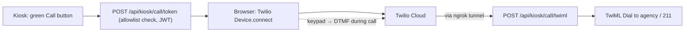

# Talk Box

**A payphone for the 21st century.** Talk Box is a Raspberry-Pi kiosk that
connects homeless and phoneless individuals directly to **211** and local
services — shelter, food, medical care, mental health — with one big green
button. No phone, no account, no login. Walk up, press Call, talk to a human
who can help.

Under the hood it's a keypad-first React kiosk, a FastAPI backend with
pgvector semantic search over a seeded agency database, and real two-way
phone calls placed straight from the browser via the Twilio Voice SDK.
Outbound dialing is **allowlisted server-side** — the kiosk can only call
known service agencies, the 211 help lines, and configured test numbers.

```
┌─────────────────────────────────────────────┐
│   📞  Call 211 — Get Help Now               │   ← the main feature
├─────────────────────────────────────────────┤
│   Ask: "I need shelter tonight"  → search   │   ← semantic agency lookup
│   Browse: 1 Shelter  2 Food  3 Medical …    │   ← numbered keypad menu
│   Dial: 211 or any allowlisted number       │   ← ATM-style dial pad
└─────────────────────────────────────────────┘
```

211 is dialable everywhere through its national access numbers:
dialing `2-1-1` on the kiosk routes to `+1 (916) 498-1000`
(toll-free `+1 (844) 546-1464` is also allowlisted).

## Repository layout

| Path | What it is |
| --- | --- |
| [`talkbox`](talkbox) | The CLI. `talkbox update` = git pull → rebuild → relaunch → ngrok → Twilio publish → health check. |
| [`pointer-fork/`](pointer-fork/) | The app: FastAPI backend, React kiosk frontend, nginx, pgvector Postgres, Docker Compose. |
| [`pointer-fork/backend/`](pointer-fork/backend/) | Python 3.13 / FastAPI / SQLAlchemy / LangChain. Seeds the agency DB + embeddings on first boot. |
| [`pointer-fork/frontend/`](pointer-fork/frontend/) | React 19 + Vite + Tailwind. Routes: `/kiosk` (real calls), `/demo` (simulated), `/` (desktop chat). |
| [`Datasets/`](Datasets/) | Reference datasets and data-source documentation. |
| [`install.sh`](install.sh) | One-shot Pi installer (Docker, repo, `.env`, build, health). |
| [`kiosk-setup.sh`](kiosk-setup.sh) | Turns the Pi into a fullscreen Chromium kiosk on boot. |
| [`ngrok-update.sh`](ngrok-update.sh) | Thin systemd wrapper around `talkbox ngrok` (re-syncs the tunnel at boot). |
| [`agent-context.yaml`](agent-context.yaml), [`pointer_kiosk_roadmap.yaml`](pointer_kiosk_roadmap.yaml) | Machine-readable project context and roadmap for AI agents. |

## Agent crib sheet (key files)

| Concern | File |
| --- | --- |
| Kiosk state machine (screens, keypad vocabulary, DTMF) | `pointer-fork/frontend/src/hooks/useKioskStateMachine.js` |
| Twilio Voice SDK hook (token → connect → sendDigits) | `pointer-fork/frontend/src/hooks/useKioskVoiceCall.js` |
| Screen router / shell | `pointer-fork/frontend/src/components/kiosk/KioskShell.jsx` |
| Kiosk HTTP API (`/api/kiosk/*`: query, token, TwiML webhook) | `pointer-fork/backend/src/presentation/kiosk_routes.py` |
| Call allowlist + 211 short-code mapping | `pointer-fork/backend/src/application/services/kiosk_call_service.py` |
| Twilio access tokens + TwiML generation | `pointer-fork/backend/src/infrastructure/voice/twilio_voice_service.py` |
| Semantic search / results / 211 fallback | `pointer-fork/backend/src/application/services/kiosk_query_service.py` |
| nginx (API proxy, mic Permissions-Policy) | `pointer-fork/nginx/default.conf` |
| All settings | `pointer-fork/.env.example` (copy to `pointer-fork/.env`) |

### How a call works



The keypad vocabulary is `1-9`, `0`, `*`, `#`. Outside a call: `0` = back,
`*` = repeat aloud, `#` = select. **During a live call every key is sent as a
DTMF tone** (so "press 0 for an operator" works); hanging up is only the red
End Call button.

## The `talkbox` CLI

```bash
./talkbox install   # once — puts `talkbox` on your PATH

talkbox update      # git pull → rebuild → relaunch → ngrok → publish webhook to Twilio → health
talkbox ngrok       # refresh tunnel + publish to Twilio only (--new forces a new URL)
talkbox status      # containers, health, tunnel, Twilio sync check
talkbox restart     # restart containers without rebuilding
talkbox logs        # tail backend logs
```

`update` reuses a live ngrok tunnel when one exists; otherwise it starts one,
pushes the fresh URL to the Twilio TwiML App via the REST API, rewrites
`TWILIO_PUBLIC_URL` in `.env`, and relaunches the stack.

## Quick start (Docker)

Requirements: Docker with Compose v2.20+ (root compose uses `include:`).

```bash
git clone https://github.com/BarkBarkBarkBarkBarkBarkBark/talkbox.git
cd talkbox

# 1. Configure
cp pointer-fork/.env.example pointer-fork/.env
#    Minimum: POSTGRES_PASSWORD, DB_URI (same password), OPENAI_API_KEY
#    For real calls: TWILIO_ACCOUNT_SID, TWILIO_AUTH_TOKEN, TWILIO_PHONE_NUMBER,
#                    TWILIO_TWIML_APP_SID, KIOSK_CALLING_ENABLED=true

# 2. Deploy everything
./talkbox update

# 3. Open it (loopback-only by default)
#    Kiosk (real calls):  http://localhost:8084/kiosk
#    Demo (simulated):    http://localhost:8084/demo
#    API health:          http://127.0.0.1:8085/api/health
```

First boot seeds Postgres with the agency database
(`pointer-fork/backend/src/infrastructure/seeds/agencies_master.csv`) and
category embeddings.

### Smoke test

```bash
curl -s 127.0.0.1:8085/api/health
curl -s 127.0.0.1:8085/api/kiosk/query -X POST \
  -H 'Content-Type: application/json' -d '{"query":"i need shelter tonight"}'
# 211 should always be allowlisted:
curl -s -X POST 127.0.0.1:8085/api/kiosk/call/token \
  -H 'Content-Type: application/json' -d '{"phone":"211"}'
```

## Phone calls (Twilio) — the safety model

Real two-way calls run through the Twilio Voice **browser SDK**: the kiosk
fetches a short-lived access token, `Device.connect()` opens the call, and
Twilio fetches dial instructions from `/api/kiosk/call/twiml` through the
ngrok tunnel. The backend refuses any number that is not:

1. in the seeded `agencies` table (matched on last 10 digits),
2. a built-in 211 help-line number, or
3. listed in `KIOSK_TEST_CALL_NUMBERS` (comma-separated, handy on trial
   accounts which can only call verified numbers).

`/demo` never places real calls. The microphone must be allowed —
nginx ships `Permissions-Policy: microphone=(self)` for this.

One-time Twilio setup: create a TwiML App (Console → Voice → TwiML Apps),
put its SID in `TWILIO_TWIML_APP_SID` — `talkbox update` keeps its Voice URL
pointed at the current tunnel automatically.

## Deploying to a Raspberry Pi

Pi 4/5, 64-bit Raspberry Pi OS, 4 GB+ RAM. Build on the Pi itself (arm64):

```bash
curl -fsSL https://raw.githubusercontent.com/BarkBarkBarkBarkBarkBarkBark/talkbox/main/install.sh | bash
bash ~/talkbox/kiosk-setup.sh       # fullscreen Chromium kiosk on boot
# systemd service for boot-time tunnel sync: see header of ngrok-update.sh
```

Ports bind to loopback by default. To expose the kiosk on your LAN, change
`127.0.0.1:8084:80` to `8084:80` in `pointer-fork/docker-compose.yml`
(keep the backend on loopback — nginx proxies `/api`).

## Development (without Docker)

```bash
# Backend (uses uv)
cd pointer-fork/backend
uv sync && uv run python main.py api

# Frontend
cd pointer-fork/frontend
npm install && npm run dev    # Vite proxies /api to 127.0.0.1:8085
```

## Known sharp edges

- **ngrok free tier**: the URL changes whenever the tunnel restarts. If the
  tunnel dies, Twilio's webhook goes stale and calls fail with "could not be
  connected" — `talkbox status` detects the drift, `talkbox ngrok` fixes it.
  A reserved ngrok domain (or Cloudflare tunnel) would eliminate this class
  of failure entirely.
- **Pending calls are in-process memory** (`_pending_calls` in
  `kiosk_routes.py`): a backend restart between token issue and Twilio's
  webhook drops the call, and multiple uvicorn workers would break it. Fine
  at single-worker kiosk scale; move to Redis/Postgres if scaling out.
- **TwiML webhook is unauthenticated**: it only dials for a valid pending
  identity UUID, so abuse is limited, but X-Twilio-Signature validation is
  the right hardening step.
- **`docker compose pull` is a trap**: images are tagged
  `ghcr.io/la-plas-growth/pointer-*:latest` but built locally. Pulling could
  clobber local builds with stale registry images. Always use
  `talkbox update` (it builds, never pulls).
- **nginx `add_header` inheritance**: any `add_header` inside a `location`
  block silently drops all server-level headers — that's why the security
  headers are repeated inside `location /` in `nginx/default.conf`.
- **Hang-up requires the touchscreen**: during a live call every keypad key
  is DTMF by design, so a keypad-only build needs a dedicated physical
  hang-up key wired to the End Call action.
