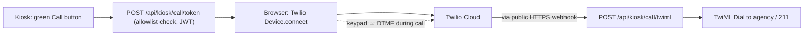

# Talk Box

**A payphone for the 21st century.** Talk Box is a Raspberry-Pi kiosk that
connects homeless and phoneless individuals directly to **211** and local
services — shelter, food, medical care, mental health — with one big green
button. No phone, no account, no login. Walk up, press Call, talk to a human
who can help.

Under the hood it's a keypad-first React kiosk, a FastAPI backend with
pgvector semantic search over a seeded agency database, and real two-way
phone calls placed straight from the browser via the Twilio Voice SDK.
Outbound dialing is **allowlisted server-side** — the kiosk can only call
known service agencies, the 211 help lines, and configured test numbers.

## Canonical resource architecture

The existing standalone Neon project named `talkbox` is the source of truth for
community organizations, categories, users, and pgvector collections. Only the
FastAPI backend receives its server-side `DB_URI`:

```text
TalkBox Neon -> TalkBox FastAPI on Fly.io -> Vercel website and TalkBox kiosks
```

Kiosk search uses the `query_categories` pgvector collection to choose a
category and then reads matching agencies from Neon. Browse reads the same
`agencies` table directly. The former FSC snapshot synchronization remains
disabled rollback code and is not a runtime authority.

The source currently supports multiple frontend/backend topologies. A local
client appliance serves React through nginx and proxies `/api/*` to its own
backend container. The Vercel frontend rewrites `/api/*` to Fly, while CI-built
frontend images may bake another backend into `VITE_API_URL`. Keep these roles
separate when configuring credentials: Fly receives backend secrets; Vercel
receives public `VITE_*` build configuration only. Kiosks call FastAPI and never
receive Neon credentials.

Normal startup does not migrate, seed, import, truncate, or create an admin.
Those operations require explicit operator commands. Mock kiosk resources are
available only when `KIOSK_MOCK_QUERY=true`.
See [`docs/adr/0001-fsc-resource-platform-source-of-truth.md`](docs/adr/0001-fsc-resource-platform-source-of-truth.md).

Authenticated superusers manage canonical resources at `/admin`. The
`show_on_kiosk` setting controls Browse visibility only; hidden resources remain
eligible for voice search. Planned Neon-to-community-kiosk propagation is
documented in [`docs/LOCAL_FIRST_KIOSK_SYNC.md`](docs/LOCAL_FIRST_KIOSK_SYNC.md).

**Entrypoint rule:** TalkBox is kiosk-first on appliances and marketing-first on
the public web. On **localhost**, `/` is the production kiosk; on **public hosts**
(Vercel), `/` is the marketing site (About, Demo, Donate). **`/kiosk` is the
hardware-stable production kiosk** (Pi Chromium default via `kiosk-setup.sh`).
`/demo` is the simulated product demo; `/donate` uses `VITE_DONATE_URL`; `/site`
always shows marketing for local preview. `/chat` is only a secondary
admin/partner console. Pointer/Health Scout are supporting routing and dataset
assets, not the app identity or appliance entrypoint.

```
┌─────────────────────────────────────────────┐
│   📞  Call 211 — Get Help Now               │   ← the main feature
├─────────────────────────────────────────────┤
│   Ask: "I need shelter tonight"  → search   │   ← semantic agency lookup
│   Browse: 1 Shelter  2 Food  3 Medical …    │   ← numbered keypad menu
│   Dial: 211 or any allowlisted number       │   ← ATM-style dial pad
└─────────────────────────────────────────────┘
```

211 is dialable everywhere through its national access numbers:
dialing `2-1-1` on the kiosk routes to `+1 (916) 498-1000`
(toll-free `+1 (844) 546-1464` is also allowlisted).

## Repository layout

| Path | What it is |
| --- | --- |
| [`talkbox`](talkbox) | The CLI. `talkbox update` = git pull → rebuild → relaunch → Twilio publish → health check. |
| [`app/`](app/) | The app: FastAPI backend, React kiosk frontend, nginx, pgvector Postgres, Docker Compose. |
| [`app/backend/`](app/backend/) | Python 3.13 / FastAPI / SQLAlchemy / LangChain. Seeds the agency DB + embeddings on first boot. |
| [`app/frontend/`](app/frontend/) | React 19 + Vite + Tailwind. Routes: public `/` marketing (Vercel); localhost `/` + `/kiosk` production kiosk; `/demo`, `/donate`, `/site`, `/chat`. |
| [`Datasets/`](Datasets/) | Reference datasets and data-source documentation. |
| [`install.sh`](install.sh) | One-shot Pi installer (Docker, repo, `.env`, build, health). |
| [`kiosk-setup.sh`](kiosk-setup.sh) | Turns the Pi into a fullscreen Chromium kiosk on boot. |
| [`twilio-sync.sh`](twilio-sync.sh) | Thin systemd wrapper around `talkbox twilio-sync` (re-syncs webhook config at boot). |
| [`agent-context.yaml`](agent-context.yaml), [`kiosk-roadmap.yaml`](kiosk-roadmap.yaml) | Machine-readable project context and roadmap for AI agents (historical, pre-rename). |

## Agent crib sheet (key files)

| Concern | File |
| --- | --- |
| Kiosk state machine (screens, keypad vocabulary, DTMF) | `app/frontend/src/hooks/useKioskStateMachine.js` |
| Kiosk voice search (`*` on Ask screen) | `app/frontend/src/hooks/useVoiceSearch.js`, `app/backend/src/application/services/kiosk_stt_service.py` |
| Twilio Voice SDK hook (token → connect → sendDigits) | `app/frontend/src/hooks/useKioskVoiceCall.js` |
| Screen router / shell | `app/frontend/src/components/kiosk/KioskShell.jsx` |
| Kiosk HTTP API (`/api/kiosk/*`: query, token, TwiML webhook) | `app/backend/src/presentation/kiosk_routes.py` |
| Call allowlist + 211 short-code mapping | `app/backend/src/application/services/kiosk_call_service.py` |
| Twilio access tokens + TwiML generation | `app/backend/src/infrastructure/voice/twilio_voice_service.py` |
| Semantic search / results / 211 fallback | `app/backend/src/application/services/kiosk_query_service.py` |
| nginx (API proxy, mic Permissions-Policy) | `app/nginx/default.conf` |
| All settings | `app/.env.example` (copy to `app/.env`) |

### How a call works


```mermaid
flowchart LR
  Button["Kiosk: green Call button"] --> Token["POST /api/kiosk/call/token (allowlist check, JWT)"]
  Token --> Connect["Browser: Twilio Device.connect"]
  Connect --> Twilio[Twilio Cloud]
  Twilio -->|"via public HTTPS webhook"| Webhook["POST /api/kiosk/call/twiml"]
  Webhook --> DialOut["TwiML Dial to agency / 211"]
  Connect -. "keypad → DTMF during call" .-> Twilio
```

The keypad vocabulary is `1-9`, `0`, `*`, `#`, plus two dedicated buttons:
**`CALL`** (green) and **`HANGUP`** (red), always visible in the footer —
touch targets today, mappable to physical GPIO/HID buttons later (keyboard
aliases: `C` / `H`). Outside a call: `0` = back, `*` = repeat aloud,
`#` = select, `CALL` = context-aware (confirm call / dial / Call 211 from
home). On the Ask screen, `*` starts one-shot voice search: record a short
request, transcribe it, and run the normal semantic search. **During a live call
every keypad key is sent as a DTMF tone** (so
"press 0 for an operator" works); only `HANGUP` ends the call.

### Arcade buttons (physical kiosk)

The physical kiosk has seven arcade buttons. A small host-side bridge
(`~/.local/bin/talkbox-button-bridge`, started at login) reads the USB encoder
and re-emits keystrokes the kiosk already understands, so the buttons and the
keyboard/keypad stay in sync.

| Button | Action | Kiosk key |
| --- | --- | --- |
| **K1** | Call 211 | `CALL_211` (≡ `9` on home) |
| **K2** | Talk — ask a question by voice | `*` |
| **K3** | Call / Enter (confirm + select) | `CALL` / `#` |
| **K4** | Hang up / Exit (back) | `HANGUP` / Back |
| **L1** | Move highlight up | `PREV` |
| **R1** | Move highlight down | `NEXT` |
| **L2** | Toggle screen (cycle Ask → Browse → Dial) | `CYCLE_TAB` |

## The `talkbox` CLI

```bash
./talkbox install   # once — puts `talkbox` on your PATH

talkbox update      # git pull → rebuild → relaunch → publish webhook to Twilio → health
talkbox twilio-sync # publish webhook to Twilio + sync backend env
talkbox status      # containers, health, public URL, Twilio sync check
talkbox restart     # restart containers without rebuilding
talkbox logs        # tail backend logs
```

`update` publishes `TWILIO_PUBLIC_URL + /api/kiosk/call/twiml` to the Twilio
TwiML App via the REST API and relaunches the stack.

## Quick start (Docker)

Requirements: Docker with Compose v2.20+ (root compose uses `include:`).

```bash
git clone https://github.com/BarkBarkBarkBarkBarkBarkBark/talkbox.git
cd talkbox

# 1. Configure
cp app/.env.example app/.env
#    Minimum: POSTGRES_PASSWORD, DB_URI (same password), OPENAI_API_KEY
#    For real calls: TWILIO_ACCOUNT_SID, TWILIO_AUTH_TOKEN, TWILIO_PHONE_NUMBER,
#                    TWILIO_TWIML_APP_SID, KIOSK_CALLING_ENABLED=true

# 2. Deploy everything
./talkbox update

# 3. Open it (loopback-only by default)
#    Production kiosk:    http://localhost:8084/kiosk  (also localhost /)
#    Marketing preview:   http://localhost:8084/site
#    Demo (simulated):    http://localhost:8084/demo
#    Donate:              http://localhost:8084/donate
#    Admin chat console:  http://localhost:8084/chat
#    API health:          http://127.0.0.1:8085/api/health
```

Local installs may bootstrap the legacy agency database for offline development.
That seed is a fallback and is not the canonical production resource source.

### Smoke test

```bash
curl -s 127.0.0.1:8085/api/health
curl -s 127.0.0.1:8085/api/kiosk/query -X POST \
  -H 'Content-Type: application/json' -d '{"query":"i need shelter tonight"}'
# 211 should always be allowlisted:
curl -s -X POST 127.0.0.1:8085/api/kiosk/call/token \
  -H 'Content-Type: application/json' -d '{"phone":"211"}'
```

## Phone calls (Twilio) — the safety model

Real two-way calls run through the Twilio Voice **browser SDK**: the kiosk
fetches a short-lived access token, `Device.connect()` opens the call, and
Twilio fetches dial instructions from `/api/kiosk/call/twiml` through your
public HTTPS URL (for example Tailscale Funnel). The backend refuses any
number that is not:

1. an active FSC API contact explicitly approved for TalkBox calling (with the
  legacy `agencies` table used only before the first canonical snapshot),
2. a built-in 211 help-line number, or
3. listed in `KIOSK_TEST_CALL_NUMBERS` (comma-separated, handy on trial
   accounts which can only call verified numbers).

`/demo` never places real calls. The microphone must be allowed —
nginx ships `Permissions-Policy: microphone=(self)` for this.

### Physical kiosk enrollment

The public `/kiosk` route intentionally allows resource search, Browse, voice
search, and 211 information without a login. Telephone privileges are separate:
only an enrolled, enabled physical TalkBox receives a short-lived Twilio Voice
token. Each enrolled browser holds an opaque `HttpOnly`, `Secure` device cookie;
Neon stores only a slow hash and an individual device can be disabled or revoked
from `/admin` without affecting the rest of the fleet.

1. Sign into `/admin` and create a one-time enrollment code in **Kiosk devices**.
2. On the prepared tablet, open `/kiosk/enroll`, enter that code, and choose a
  label/location (or the assigned `TB-xxx` code).
3. Confirm the tablet returns to `/kiosk`, then verify it appears in `/admin`.
4. Disable or revoke the device from `/admin` to immediately prevent future
  call-token requests.

Run `cd app/backend && python main.py migrate` explicitly before deploying this
feature. Migrations never run automatically at application startup.

For temporary development provisioning only, set these values in an ignored
local backend environment file or as Fly secrets, then remove or rotate them
when finished:

```bash
KIOSK_REUSABLE_ENROLLMENT_ENABLED=true
KIOSK_REUSABLE_ENROLLMENT_CODE=<development-only code>
```

The reusable value is a global enrollment secret, not a device credential. Every
successful use still creates a distinct revocable `TB-xxx` device. Do not place
it in Vercel variables, frontend source, `.env.example`, or committed Fly config.

Production Fly configuration must set `CORS_ORIGINS` to the canonical TalkBox
origins (currently `https://talk-box.org,https://www.talk-box.org`) and keep
`DB_URI`, all Twilio values, `JWT_SECRET`, and any reusable enrollment value as
Fly secrets. Vercel receives no database or Twilio secret.

One-time Twilio setup: create a TwiML App (Console → Voice → TwiML Apps),
put its SID in `TWILIO_TWIML_APP_SID`, and set `TWILIO_PUBLIC_URL` in `.env`
to your stable public host URL.

## Voice search (`*` on Ask)

The kiosk can do local-first, push-button speech search. On the Ask tab, press
`*`, speak for up to `KIOSK_STT_MAX_SECONDS`, and the frontend posts microphone
audio to `POST /api/kiosk/speech/transcribe`. The backend converts the browser
audio with `ffmpeg`, runs `whisper.cpp`, inserts the transcript into the Ask
field, and then uses the existing `/api/kiosk/query` search path.

Configure it in `app/.env`:

```bash
KIOSK_STT_ENABLED=true
KIOSK_STT_PROVIDER=local        # local | openai | auto
KIOSK_STT_WHISPER_BIN=/usr/local/bin/whisper-cli
KIOSK_STT_MODEL_PATH=/models/ggml-tiny.en-q5_1.bin
KIOSK_STT_MAX_SECONDS=6
```

The one-line Pi installer builds a pinned `whisper.cpp` binary into the backend
image, downloads the quantized tiny English model once with checksum
verification, and mounts it read-only at the configured model path. Normal
`talkbox update` runs reuse the downloaded model.

## Deploying to a Raspberry Pi

Pi 4/5, 64-bit Raspberry Pi OS, 4 GB+ RAM. Build on the Pi itself (arm64):

```bash
curl -fsSL https://raw.githubusercontent.com/BarkBarkBarkBarkBarkBarkBark/talkbox/main/install.sh | bash
bash ~/talkbox/kiosk-setup.sh       # fullscreen Chromium kiosk on boot
# systemd service for boot-time Twilio sync: see header of twilio-sync.sh
```

After kiosk setup, use the maintenance escape hatch from the kiosk session:

- `Ctrl+Alt+T` (or `Ctrl+Alt+F4`) exits kiosk X and opens a plain tty shell.
- Run `nmtui` there for Wi-Fi configuration, or any Linux commands.
- Type `exit` to return to kiosk mode automatically.

Ports bind to loopback by default. To expose the kiosk on your LAN, change
`127.0.0.1:8084:80` to `8084:80` in `app/docker-compose.yml`
(keep the backend on loopback — nginx proxies `/api`).

## Development (without Docker)

```bash
# Backend (uses uv)
cd app/backend
uv sync && uv run python main.py api

# Frontend
cd app/frontend
npm install && npm run dev    # Vite proxies /api to 127.0.0.1:8085
```

## Canonical database configuration

- `DB_URI`: server-side TalkBox Neon connection; required by FastAPI.
- `FSC_RESOURCE_SYNC_ENABLED=false`: keeps the abandoned upstream integration
  dormant.
- `KIOSK_MOCK_QUERY=false`: prevents sample resources in production.
- `TALKBOX_SEED_ADMIN=false`: keeps startup read-only.

Never add `DB_URI`, OpenAI, Twilio, JWT, or admin secrets to Vercel.

## Known sharp edges

- **Public URL drift**: if `TWILIO_PUBLIC_URL` in `.env`, the backend container,
  and Twilio VoiceUrl do not match, webhooks can fail. `talkbox status` detects
  drift and `talkbox twilio-sync` repairs it.
- **Pending calls are in-process memory** (`_pending_calls` in
  `kiosk_routes.py`): a backend restart between token issue and Twilio's
  webhook drops the call, and multiple uvicorn workers would break it. Fine
  at single-worker kiosk scale; move to Redis/Postgres if scaling out.
- **TwiML webhook auth depends on `TWILIO_PUBLIC_URL`**: X-Twilio-Signature
  is validated against that URL, so if `.env` is stale the webhook returns 403.
  `talkbox update` / `talkbox twilio-sync` keep it in sync.
- **`docker compose pull` is a trap**: images are tagged
  `ghcr.io/la-plas-growth/talkbox-*:latest` but built locally. Pulling could
  clobber local builds with stale registry images. Always use
  `talkbox update` (it builds, never pulls).
- **nginx `add_header` inheritance**: any `add_header` inside a `location`
  block silently drops all server-level headers — that's why the security
  headers are repeated inside `location /` in `nginx/default.conf`.
- **Physical buttons not wired yet**: the green/red footer buttons emit the
  `CALL` / `HANGUP` key vocabulary (keyboard `C` / `H`), so a GPIO or HID
  button pair just needs to emit those keys — no UI changes required.
